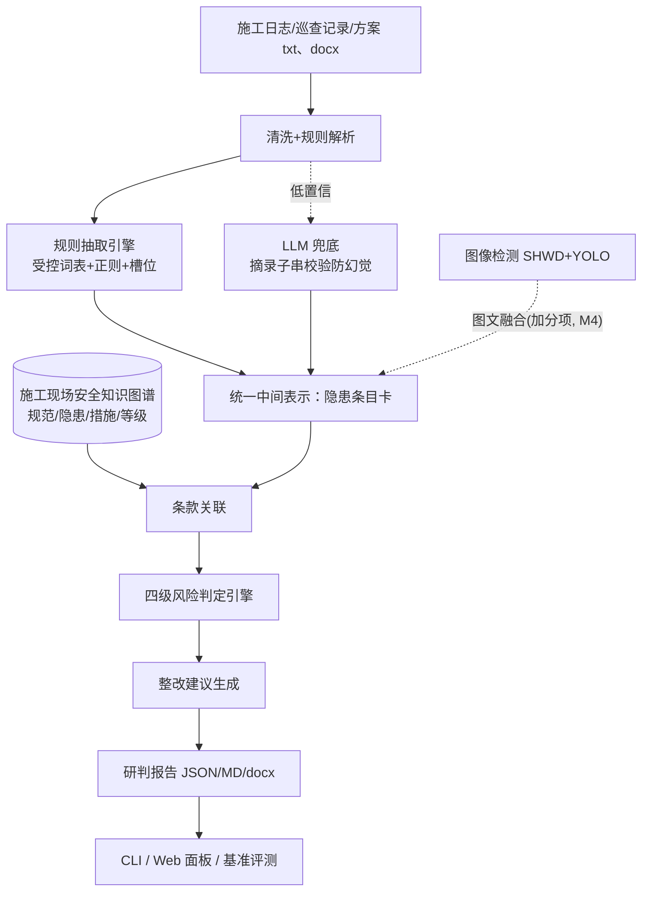

# SiteGuard — 融合 LLM 与知识图谱的施工现场安全风险隐患智能研判系统

> 规则优先 · 知识图谱承载判定 · LLM 仅兜底——结论可溯源、可评测、可复现。

把施工日志、安全巡查记录、施工方案等非结构化文本，自动变成
**"隐患实体 → 关联规范条款 → 风险四级判定（低/一般/较大/重大） → 可执行整改建议"**
的结构化研判结果。全过程以**施工现场安全知识图谱**为推理骨干，LLM 仅做抽取兜底与行文，
数值与分级结论全部来自确定性规则——**每条结论都带条款编号与原文摘录，可溯源、可评测、可复现**。

技术方案全文见 [docs/技术方案.md](docs/技术方案.md)；演示命令清单见
[docs/演示命令.md](docs/演示命令.md)；KG 构建方法见 [docs/kg-构建方法.md](docs/kg-构建方法.md)；
多模态融合方法见 [docs/多模态融合方法.md](docs/多模态融合方法.md)。

## 功能特性

- **风险隐患自动识别**：规则引擎（正则+槽位+受控词表）为主通路，LLM 兜底口语化长尾描述（可关断）；
- **知识图谱增强推理**：规范条文/隐患类型/整改措施/风险等级/实例 五类节点，条款关联与分级判定都在图上完成；
- **四级风险判定**：对齐《房屋市政工程生产安全重大事故隐患判定标准（2022版）》情形 → 重大风险，严重词上调一档封顶重大，其余按受控词表基础档；
- **整改建议生成**：条款措施模板化生成，建议必带出处；
- **研判报告**：一条命令产出 JSON + Markdown + Word（docx 含编制/审核/批准签署栏与日期占位线，无外链图片）；
- **Web 面板（M5）**：`serve` 一条命令启动（FastAPI + 免构建静态页）——上传施工日志/巡查记录或一键载入两示例场景 → 隐患卡片（风险等级/条款锚点跳转 KG/整改建议）→ JSON/Markdown/Word 三格式下载；页面零第三方依赖、0 外链 CDN、断网可演示；缺依赖优雅提示不崩溃；
- **KG 离线可视化（M3）**：pyvis 单文件 HTML（资源内嵌、0 外链），Category/RiskLevel 过滤、点击隐患类型高亮一跳邻居、悬浮看条文原文、报告条款锚点定位；
- **内置基准评测**：程序化生成带真值语料（seed=42 可复现），零 API 依赖跑 F1、分级准确率与端到端检出率/误报率；
- **docx 解析**：python-docx 可选依赖（坏文件/缺依赖优雅报错），样例由脚本程序生成；
- **LLM 兜底**：DashScope OpenAI 兼容接口（qwen，enable_thinking=false），默认关闭、未配置降级、伪造摘录一律拒绝（防幻觉三件套）；
- **图文融合（M4）**：YOLO 系视觉通路（ultralytics 可选依赖）检出未佩戴安全帽 → 条目卡，与文本卡按"部位+时间窗"对齐合并（`merged_from` 回填、置信度取高、证据合并保留双方出处）；缺依赖/坏图/禁用三路优雅降级，`demo --with-vision` 一键演示；
- **视频抽帧（M6 加分项）**：`demo --video` 从视频均匀抽样关键帧（含首帧，选帧纯函数可独立测试）复用上述视觉通路参与图文融合，无需新模型；opencv 进 optional `video` 组，缺依赖/坏文件打印说明降级 exit 0；
- **向量检索兜底（M6 加分项）**：`demo --vector-fallback` 对条款留空卡片（如 HT-GCZY-007）以字符 n-gram TF-IDF 词法向量检索 54 条条文库补充候选条款，逐条标注"非判定依据"，不改动任何判定字段；纯 stdlib 实现、评测零依赖，embedder 可注入预留语义向量后端。

## 快速开始

环境要求：Python ≥ 3.8（本机 3.8.8 实测），**核心链路零第三方依赖**。

```bash
# 1. 生成样例语料与真值（幂等，seed=42 可复现）
py -X utf8 -m siteguard.cli datagen

# 2. 两大典型场景端到端研判（高处作业 + 临时用电），报告输出到 examples/demo_output
py -X utf8 -m siteguard.cli demo

# 3. 构建种子知识图谱并导出统计（examples/kg/kg.html 离线可开）
py -X utf8 -m siteguard.cli build-kg

# 4. 内置基准评测（解析 F1 + 分级准确率，误报须为 0）
py -X utf8 -m siteguard.cli eval

# 5. 全部单元测试
py -X utf8 -m unittest discover -s tests -v
```

Linux/macOS 把 `py -X utf8` 换成 `python3` 即可。

可选增强（依赖只进 `pyproject.toml` optional 组，缺依赖一律优雅降级不崩溃）：

```bash
# Web 面板：上传/载入示例 → 隐患卡片 → 报告下载（页面 0 外链，断网可演示）
py -m pip install fastapi uvicorn -i https://pypi.tuna.tsinghua.edu.cn/simple
py -X utf8 -m siteguard.cli serve --port 8000

# Word 报告导出（含签署栏）
py -m pip install python-docx
py -X utf8 -m siteguard.cli demo --docx

# 图文融合演示（YOLO 视觉通路）
py -X utf8 -m siteguard.cli demo --with-vision
```

## 架构



## 内置基准（M1 v2 语料，随开发持续更新）

| 指标 | 数值 | 目标 | 说明 |
| --- | --- | --- | --- |
| 隐患抽取 微平均 F1 | 1.0000 | ≥ 0.90 | 生成器真值 vs 规则通路，零 API 依赖 |
| 误报数 FP | 0 | 0（硬性） | 正常记录不得误判为隐患 |
| 分级准确率 | 1.0000 | 1.00 | 生成语料上四级判定与期望一致 |
| 字段级 F1（hazard_type / category / site_object） | 1.0000 / 1.0000 / 1.0000 | ≥ 0.90 | 在 (记录序号, 隐患类型) 对齐命中对上统计 |
| 配对差异检出 | 8/8，误报差异 0 | 全检出 | 施工日志版 vs 巡查记录版各注入 4 处已知差异（漏项/数值不一致/多报） |
| 端到端检出率（全链路研判 vs gold） | 1.0000（108/108） | ≥ 0.90 | 解析→抽取→条款关联→四级判定全链路结果与真值对齐 |
| 端到端误报率 | 0.0000（0/108） | 0（硬性） | 与抽取级 FP=0 同口径硬约束 |
| KG 节点 / 边 | 187 / 238 | ≥ 100 节点 | `build-kg` 实测，`examples/kg/kg_stats.json` |
| 单元/集成测试 | 134 项全绿（78 基线+23 M4+20 M5+13 M6） | 全绿 | 含失败路径：缺文件/坏格式/缺依赖/服务不可用 |

语料规模（生成器 v2，seed=42 可复现）：两大场景各 **54 条隐患 + 14 条正常记录**
（含多行记录、4 种时间戳表面格式），每类隐患 6 种口语化变体；配对语料 2 组
（每组约 22 条记录）。

知识库规模（M4/M5 现状）：条文 **54 条**（含建质规〔2022〕2号官方原文摘录 40 条，
sha256 与来源链登记 `data/README.md` 查证记录）、阈值 **7 条**、规则库 **53 条**
（15 override + 7 阈值规则 + 31 基础规则）、措施 **29 条**、脱敏案例 **10 条**、
词表 **31 类/8 大类**；KG **187 节点 / 238 边**（节点规模 ≥100 目标达标；可视化
`examples/kg/kg.html` 离线单文件 0 外链——过滤/高亮/悬浮/条款锚点，构建方法见
`docs/kg-构建方法.md`）。

复现方式：`py -X utf8 -m siteguard.cli datagen --force`（样例与真值重新生成，seed=42 位级可复现）→ `py -X utf8 -m siteguard.cli eval`（评测报告写入 `examples/eval_report.json`）。种子数据完整性校验：`py -X utf8 -m scripts.verify_seed_data`。

## 目录结构

```
├── plan/            # 项目计划（总览/架构与选型/模块详设/数据计划/里程碑）
├── data/            # 数据台账：samples 样例 / knowledge 法规知识库 / eval 真值
├── siteguard/       # 源码：ingest 解析 / extract 抽取 / kg 图谱 / reasoning 研判 /
│                    #   pipeline 流水线 / report 导出(JSON/MD/docx) / serverapp Web 服务
├── webapp/          # Web 面板静态页（免构建 vanilla HTML/JS/CSS，0 外链）
├── scripts/         # 生成器入口 / 种子校验 / 脱敏审查 / Web 演示与冒烟脚本
├── tests/           # 单元测试（含失败路径：缺文件/坏格式/缺依赖/服务不可用）
├── examples/        # demo 与评测产物、KG 三件套
├── benchmarks/      # 基准说明
└── docs/            # 技术方案 / 演示命令 / KG 构建方法 / 多模态融合方法
```

## 开发状态（里程碑）

| 里程碑 | 内容 | 状态 |
| --- | --- | --- |
| M0 | 计划文档 + 可运行骨架（规则通路端到端 + 种子图谱 + 基准） | ✅ |
| M1 | 数据与解析：生成器 v2（≥50 条/场景 + 配对语料）、多行合并/时间容错解析、字段级 F1 基准 | ✅ |
| M2 | 知识与规则：条文 54（官方原文核验 + M1 勘误落库）、规则库 v1 数据驱动（override+阈值判定）、docx 解析、LLM 兜底通路、端到端评测 | ✅ |
| M3 | 图谱与可视化：pyvis 离线 HTML（过滤/高亮/悬浮/条款锚点定位；缺 pyvis 优雅降级）、docs/kg-构建方法.md | ✅ |
| M4 | 多模态与图文融合：SHWD 抽样入仓+台账登记、视觉检测通路（三路降级 + 受控词表映射）、merge_cards 同部位+时间窗融合、`demo --with-vision` | ✅ |
| M5 | 交付打磨：Web 面板 serve（FastAPI+免构建静态页，0 外链断网可演示，≥2 场景真实演示）、docx 报告导出+签署栏、docs/技术方案.md 与 README 评测表、脱敏四步审查（程序化脚本全 PASS 留痕）、演示命令清单、发布 GitHub | ✅ |
| M6 | 收尾与材料固化：发布物复核与全量回归复跑、v0.1.0 tag+release、仓库 topics、技术方案 docx 程序化固化、缓冲周加分项（视频抽帧+向量检索兜底） | ✅ |

## 免责与合规说明

- `data/knowledge/` 中的条文为**研究性摘录概括**，标注"以官方文本为准"；
  正式使用请核对 JGJ 59-2011、JGJ 80-2016、JGJ 46-2005、建质规〔2022〕2号 等标准原文。
- 样例数据由程序生成，非真实项目；含真实个人信息的数据一律不入库（见 `data/README.md` 台账
  与脱敏四步审查记录，脚本 `py -X utf8 -m scripts.desensitize_audit` 可重跑验证）。

## License

[MIT](LICENSE)
