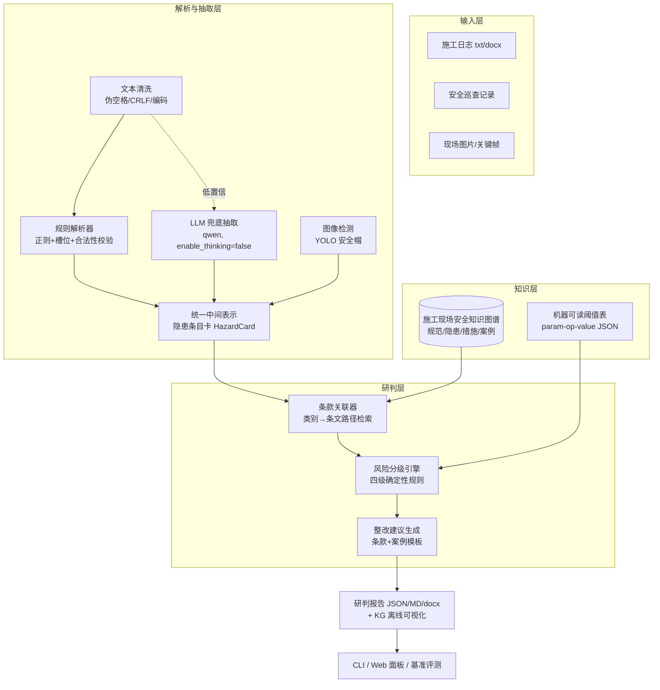

# SiteGuard 技术方案

> 融合 LLM 与知识图谱的施工现场安全风险隐患智能研判系统

## 1. 问题与总体思路

施工日志、安全巡查记录、施工方案等非结构化文本承载了大量现场隐患信息，但人工研判
存在三条痛点：**看不出**（隐患描述口语化、专业性强）、**判不准**（风险分级依赖个人
经验）、**挂不上**（结论难落到具体规范条款）。SiteGuard 把这些文本（及现场图片，
加分项）自动变成

**"隐患实体 → 关联规范条款 → 风险四级判定（低/一般/较大/重大） → 可执行整改建议"**

的结构化研判结果。四条设计原则：

1. **规则优先，LLM 兜底**：隐患识别先走关键词+槽位+合法性校验的规则通路（零 API
   依赖、可评测、可复现）；LLM 只处理规则无法覆盖的口语化/长尾描述，且必须回传
   "原文摘录"做子串校验。
2. **统一中间表示 = 隐患条目卡**：文本规则、LLM、图像检测三路抽取同构化为同一结构
   （实体-类别-位置-置信度-证据），图文融合问题归约为条目卡的对齐合并。
3. **图谱即规则载体**：规范条文、阈值、风险分级标准都建成知识图谱节点/属性，研判 =
   在图上做路径检索 + 确定性规则判定，结论必须挂条款依据（防幻觉的根）。
4. **数据先行**：以程序化生成器自制带真值语料（seed=42 可复现、可注入已知差异），
   评测零成本重复、不依赖人工标注；规范条文以官方可核验文本为准，查证失败不编造。

## 2. 系统架构

工程形态与选型：

| 层 | 选型 | 说明 |
| --- | --- | --- |
| 语言/运行时 | Python 3.8+（3.8.8 实测） | Python 优先 |
| CLI | argparse（stdlib） | 零依赖骨架先行 |
| 文本解析 | re + 槽位校验 | 规则优先、可评测 |
| docx 解析/导出 | python-docx（optional `doc` 组） | 坏文件/缺依赖 ValueError 容错 |
| LLM | DashScope OpenAI 兼容接口（qwen，纯 requests） | 默认关闭、可注入 transport 零 API 评测 |
| 图像检测 | YOLO 系（ultralytics，optional `vision` 组）+ SHWD | 加分项、离线推理、三路优雅降级 |
| KG 可视化 | pyvis 离线 HTML（optional `kg` 组） | 资源内嵌单文件，0 外链 |
| Web 面板 | FastAPI + 免构建静态页（optional `web` 组） | 页面零第三方依赖、0 外链 CDN、断网可演示 |
| 报告 | JSON → Markdown → docx | 渐进增强；docx 含签署栏 |
| 测试 | unittest（stdlib） | 134 项全绿，含失败路径 |

依赖纪律：**所有第三方依赖只进 `pyproject.toml` 的 optional 组**（llm/doc/kg/vision/
web），核心链路（解析→规则抽取→条款关联→分级→报告 JSON/MD）零第三方依赖即可运行；
任何依赖缺失走优雅降级（打印安装提示、不崩溃），照 M3 pyvis / M4 detector /
M5 fastapi 的可注入范式。

## 3. LLM 选型与防幻觉三件套

**选型**：阿里云百炼 DashScope OpenAI 兼容 `/chat/completions`，qwen 系列
（`enable_thinking=false` 提速），纯 requests 调用、本地 ollama 可替换；LLM **默认
关闭**（环境变量 `SITEGUARD_DISABLE_LLM=1` 或 config/settings.json，密钥仅经
`DASHSCOPE_API_KEY` 环境变量注入，不落仓库），transport 可注入使评测与测试零 API 依赖。

**为什么 LLM 只做兜底**：研判结论必须可评测、可复现、可追责。数值与分级全部来自
确定性规则（规则库 31 基础 + 15 override + 7 阈值规则），LLM 输出只是候选条目卡，
且要过"三件套"才能进报告：

1. **候选行压缩**：只把含隐患关键词/数字的行送 LLM，控制 token 成本与噪声；
2. **摘录子串校验**：要求 LLM 返回 `{"quote": "原文逐字摘录", ...}`，
   `quote not in 原文` 即整条丢弃——编造内容物理上进不了报告；
3. **合法性范围校验**：数值字段超物理合理范围即丢弃，分类字段必须在受控词表内
   （31 类隐患/8 大类，词表外一律拒绝）。

客户端纪律：超时与指数退避重试（默认 2 次后整体降级规则通路）、截断修复重试一次、
全程可关断。LLM 卡片 `confidence < 0.6 or extractor == "llm"` 一律进报告
"待人工确认"单列，人机责任边界清晰。

## 4. 施工现场安全知识图谱（KG 构建方法）

> 完整建模/装载/可视化设计见 `docs/kg-构建方法.md`，此处为技术方案摘要。

- **节点（8 类种子 + 1 类运行时实例）**：Regulation 条文 54、HazardType 隐患类型 31、
  Measure 整改措施 29、Case 案例 10、SiteObject 部位 44、WorkType 作业 7、
  RiskLevel 4、Category 大类 8，合计 **187 节点 / 238 边**（≥100 节点目标达标；
  HazardInstance 实例研判时动态挂图，不计种子预算）。
- **关系（7 种）**：应依据（HazardType→Regulation）、整改用（→Measure）、
  风险分级（→RiskLevel）、属于（→Category）、作业类型（→WorkType）、
  发生于（→SiteObject）、涉及（Case→HazardType）。
- **数据来源纪律**：建质规〔2022〕2号 40 条为住建部官方 docx 原文逐字摘录
  （sha256 与来源链登记 `data/README.md` 查证记录）；JGJ 系列为标注"以官方文本为准"
  的摘录概括；未经官方核验的扩充条目不入库（查证失败不编造，待核验清单留痕）。
- **种子装载与实例挂图**：`config.load_schema()` 一次装载五类种子 →
  `kg/schema.build_seed_graph` 按 id 规则建图 → 研判流水线对每张条目卡
  `attach_instance` 生成 `HI:{card_id}` 运行时节点并挂边。种子图谱保证 ≥100 节点
  不依赖运行时数据。
- **离线可视化与条款锚点**：pyvis `cdn_resources="in_line"` 全内嵌 + 模板残留外链
  剔除 → `kg.html` 单文件 0 外链断网可开（测试硬断言）；节点类型着色、
  Category/RiskLevel 过滤、点击隐患类型高亮一跳邻居、悬浮显示条文原文；
  研判报告每条条款引用由 `kg/anchors.py` 统一注入 `kg.html#REG%3A...%23...`
  锚点（54/54 覆盖），点击自动定位并高亮条文节点。

## 5. 多模态图文融合（融合推理策略）

> 完整设计见 `docs/多模态融合方法.md`，此处为技术方案摘要。

- **视觉通路**：YOLO 系检测（SHWD 官方仓库抽样 2 张入仓，MIT 许可，逐张台账登记
  sha256 与脱敏检查），检出类别按**类别名映射受控词表**（`head`→HT-GCZY-007
  未佩戴安全帽）；词表未登记的检出丢弃 + 警告，不得硬编码未登记 id；缺依赖/坏图/
  禁用三路优雅降级；无真实检出不得伪造（注入检测器仅限测试并标注）。
- **融合 = 条目卡对齐合并**：同 `site_object` 且同 `hazard_type_id` 的文本卡与
  视觉卡合并——`merged_from` 回填双方来源、`confidence` 取高、`evidence` 合并
  保留双方出处（视觉证据收进 `evidence["vision"]`）；两侧均有可解析时间时施加
  60 分钟时间窗（含边界），任一侧缺时间不施加；未命中的视觉卡独立研判。
  不带视觉输入时纯文本通路行为逐位不变（eval 全指标不变、demo 产物逐字段一致）。
- **人机边界**：低置信视觉卡（<0.6）与 LLM 卡一致进"待人工确认"。
- **视频抽帧（M6 缓冲周加分项）**：`demo --video` 对现场视频均匀抽样关键帧（含首帧，
  选帧为纯函数可独立测试）→ 直接复用上述视觉通路参与图文融合，**无需新模型**；
  opencv-python 只进 optional `video` 组，缺依赖/坏文件打印说明降级 exit 0。

## 6. 研判流程与风险四级判定

端到端链路：`解析（多行合并/4 种时间戳容错/docx）→ 规则抽取（31 基础规则 +
15 override + 7 阈值规则）→（可选）LLM 兜底 →（可选）视觉融合 → 条款关联 →
四级判定 → 建议生成 → 报告导出（JSON/MD/docx）`。单条目失败降级不中断
（warnings 汇总），保证任何时刻有可用产物。

风险分级为**确定性规则，命中即停、从重**：

1. **重大风险**：命中《房屋市政工程生产安全重大事故隐患判定标准（2022版）》
   （建质规〔2022〕2号）任一情形；
2. **较大风险**：危大工程相关违规、JGJ59 保证项目不达标、阈值表超限
   （如防护栏杆缺失且高度>2m、悬臂高度 2/5 架体高度、6m 等）；
3. **一般风险**：保证项之外的一般违章；
4. **低风险**：轻微不符合、文档类瑕疵。

每条判定输出 `level + rule_id + clause_ref + 原文证据`，条款可跳转 KG 可视化定位。

条款留空卡片（如 HT-GCZY-007 未佩戴安全帽，官方条文通道受限不编造）可经**向量检索
兜底**（M6 缓冲周加分项，`--vector-fallback` 显式启用）补充候选条款：字符二元组
TF-IDF 词法向量检索 54 条条文库（纯 stdlib 实现、评测零依赖，embedder 可注入预留
语义后端），候选逐条标注"非判定依据"，不改动任何判定字段——兜底只提示、结论仍
全部来自确定性规则。

## 7. 评测与结论

评测语料由生成器程序化产出（seed=42 位级可复现）：两大场景（高处作业/临时用电）
各 **54 条隐患 + 14 条正常记录**，每类隐患 6 种口语化变体，含多行记录与 4 种时间戳
表面格式；另配对语料 2 组（施工日志版 vs 巡查记录版，各注入 4 处已知差异）。
**评测零 API 依赖**，`py -X utf8 -m siteguard.cli eval` 一键复现。

| 指标 | 实测 | 目标 |
| --- | --- | --- |
| 隐患抽取 微平均 F1 | **1.0000** | ≥ 0.90 |
| 误报数 FP | **0** | 0（硬性） |
| 分级准确率 | **1.0000** | 1.00 |
| 字段级 F1（hazard_type/category/site_object） | **1.0000 / 1.0000 / 1.0000** | ≥ 0.90 |
| 配对差异检出 | **8/8，误报差异 0** | 全检出 |
| 端到端检出率（全链路 vs gold） | **1.0000（108/108）** | ≥ 0.90 |
| 端到端误报率 | **0.0000（0/108）** | 0（硬性） |
| KG 规模 | **187 节点 / 238 边** | ≥ 100 节点 |
| 单元/集成测试 | **134 项全绿**（78 基线+23 M4+20 M5+13 M6，含失败路径：缺文件/坏格式/缺依赖/服务不可用） | 全绿 |
| 产物外链 | **0 外链 CDN**（kg.html / Web 静态页 / docx） | 断网可演示 |

结论：在可复现语料上，规则通路即可达到抽取与端到端满分、零误报；LLM 兜底与视觉
通路作为可选增强，其输出同样受三件套与受控词表约束，不引入幻觉通道。

## 8. 交付与运行

- **演示命令清单**：见 `docs/演示命令.md`（datagen / demo / demo --with-vision /
  build-kg / eval / serve 各一行说明与预期输出）。
- **Web 面板**：`py -X utf8 -m siteguard.cli serve`（FastAPI + 免构建静态页，
  页面零第三方依赖、0 外链，断网可演示）——上传施工日志/巡查记录或一键载入
  高处作业/临时用电示例 → 页面展示隐患卡片（风险等级/条款锚点/整改建议）→
  JSON/Markdown/Word（含签署栏）三格式下载。缺 fastapi/uvicorn 时打印安装提示
  exit 2 不崩溃。
- **Word 报告**：`demo --docx` 或 Web 下载；含编制/审核/批准签署栏与日期占位线；
  docx 无任何图片与外链。
- **脱敏与合规**：密钥（.env/config/settings.json 不入仓，API key 走环境变量）、
  个人信息、个人路径、二进制内容四步程序化审查
  （`py -X utf8 -m scripts.desensitize_audit`，全通过输出 DESSENSITIZE_AUDIT_OK）；
  样例数据均为程序生成，非真实项目；数据台账见 `data/README.md`。
- **免责说明**：`data/knowledge/` 条文为研究性摘录概括，正式使用请核对 JGJ 59-2011、
  JGJ 80-2016、JGJ 46-2005、建质规〔2022〕2号 等标准原文。

## 9. 创新点小结

1. **条目卡统一中间表示**：文本/LLM/视觉三路抽取同构化，融合问题归约为结构对齐；
2. **结论即证据链**：每条风险判定强制挂条款编号 + 原文摘录 + KG 锚点，可逐条溯源；
3. **零 API 依赖可复现基准**：纯规则通路跑出 F1/误报率，指标随仓库交付、一键复现；
4. **可关断的 LLM 兜底**：摘录子串校验 + 词表校验 + 数值合法性三道闸，幻觉条目
   物理上无法进入报告；
5. **生成器即真值**：自制带真值语料可无限扩充，评测不依赖人工标注；
6. **全链路优雅降级**：pyvis/ultralytics/fastapi 全部 optional 化，缺依赖不崩溃，
   演示物（KG 可视化、Web 面板、Word 报告）全部离线可用、0 外链。
