# 02 架构与技术选型

## 1. 分层架构

```mermaid
flowchart TB
    subgraph 输入层
        A1[施工日志 txt/docx]
        A2[安全巡查记录]
        A3[施工方案/安全措施]
        A4[现场图片/关键帧]
    end
    subgraph 解析与抽取层
        B1[文本清洗<br/>伪空格/CRLF/编码]
        B2[规则解析器<br/>正则+槽位+合法性校验]
        B3[LLM 兜底抽取<br/>qwen, enable_thinking=false]
        B4[图像检测<br/>YOLO 安全帽/马甲]
        B1 --> B2 --> C
        B1 -.低置信.-> B3 --> C
        B4 --> C
    end
    C[统一中间表示<br/>隐患条目卡 HazardCard]
    subgraph 知识层
        D1[(施工现场安全知识图谱<br/>规范/隐患/措施/案例)]
        D2[机器可读阈值表<br/>param-op-value JSON]
    end
    subgraph 研判层
        E1[条款关联器<br/>类别→条文路径检索]
        E2[风险分级引擎<br/>四级确定性规则]
        E3[整改建议生成<br/>条款+案例模板, LLM 行文]
    end
    C --> E1 --> E2 --> E3
    D1 --> E1
    D2 --> E2
    E3 --> F[研判报告<br/>JSON/MD/docx + KG 可视化]
    F --> G[CLI / Web 面板 / 基准评测]
```

## 2. 技术选型表

| 层 | 选型 | 理由 | 兼容性 |
| --- | --- | --- | --- |
| 语言/运行时 | Python ≥3.8（本机 3.8.8） | Python 优先；本机约束 | 骨架零第三方依赖 |
| 配置 | YAML（pyyaml，可选）+ 环境变量 | 密钥不落仓库 | stdlib fallback: JSON |
| CLI | argparse（stdlib） | 零依赖骨架先行；后续可换 typer | ✅ |
| 图数据结构 | 内置 SimpleGraph（dict 邻接表）→ networkx 适配器导出 | smoke test 零依赖；networkx 按里程碑引入 | ✅ |
| KG 可视化 | pyvis（离线 HTML，vendor 产物） | 满足 ≥100 节点交互图 | M3 引入 |
| 文本解析 | re + 自定义槽位校验 | 规则优先，可评测 | ✅ |
| docx 解析/导出 | python-docx | 输入材料多为 docx；报告导出 | M2 引入 |
| LLM | 阿里云百炼 DashScope：qwen-plus / qwen3 系列，OpenAI 兼容 HTTP；本地 ollama 备选 | 国内可用、便宜、支持 enable_thinking=false 提速 | M2 引入，纯 requests 调用 |
| 图像检测 | YOLO 系（ultralytics）+ SHWD 微调权重 | 加分项；离线推理 | M4 引入，可选依赖 |
| Web | FastAPI + 免构建静态页（vendor Vue3/PDF.js 可选） | 演示不依赖 CDN | M5 引入 |
| 报告 | JSON → Markdown → docx | 渐进增强 | M2 JSON/MD，M5 docx |
| 测试 | pytest（或 unittest stdlib） | 骨架期用 unittest 即可 | ✅ |

## 3. LLM 防幻觉三件套（兜底通路纪律）

1. **候选行压缩**：只把含隐患关键词/数字的行送 LLM，控制 token 成本与噪声。
2. **摘录子串校验**：要求 LLM 输出 `{"quote": "原文逐字摘录", ...}`；
   `quote not in 原文` 即丢弃该条，杜绝编造。
3. **合法性范围校验**：数值字段（人数/高度/电压/距离等）超物理合理范围即丢弃；
   分类字段必须在受控词表内。

客户端纪律：`enable_thinking=false`（qwen3 系提速）、`max_tokens` 截断后的 JSON 修复
（截断重试一次 → 仍失败降级规则通路）、超时与指数退避重试、全程可关
（`SITEGUARD_DISABLE_LLM=1`）。

## 4. 知识图谱建模（详见 03/04 文档）

- **节点**：`Regulation(规范条文)`、`HazardType(隐患类型)`、`HazardInstance(实例)`
  、`Measure(整改措施)`、`Case(历史案例)`、`SiteObject(部位/设备)`、`WorkType(作业类型)`
  、`RiskLevel(风险等级)`。
- **关键关系**：`HazardType —应依据→ Regulation`、`HazardType —整改用→ Measure`
  、`HazardType —风险分级→ RiskLevel`、`HazardInstance —实例化→ HazardType`
  、`HazardInstance —发生于→ SiteObject`、`Case —涉及→ HazardType`。
- **构建方法**：条文块 JSONL（人工整理+脚本校验）为骨架（≈150 节点起步），
  抽取出的实例动态挂图 —— 100 节点要求由种子图谱保证，不依赖运行时数据。

## 5. 风险四级判定策略（确定性）

判定顺序（命中即停，从重）：

1. **重大风险**：命中《房屋市政工程生产安全重大事故隐患判定标准（2022版）》
   （建质规〔2022〕2号）任一情形的规则 id；
2. **较大风险**：危险性较大的分部分项工程相关违规、JGJ59 保证项目不达标、
   阈值表超限（如临电配电箱"一机一闸一漏"缺失、高处作业无防护栏杆且高度>2m 等）；
3. **一般风险**：一般违章（未挂安全带、无交底记录等保证项之外的不合格项）；
4. **低风险**：轻微不符合、文档类瑕疵。

每条判定输出：`level + rule_id + clause_ref + 原文证据`，四档命名固定：
低风险 / 一般风险 / 较大风险 / 重大风险。

## 6. 关键工程陷阱清单（从开发第一天规避）

- PDF/CAD 导出文本的**逐字符伪空格** → 清洗层统一处理；
- **多行隐患记录**按 y/序号邻近合并再解析；合并行内多构件按标签切分；
- **CRLF 残留**、**中文路径**（open 路径全用 pathlib + utf-8）、
  **GBK 控制台**（所有脚本 `py -X utf8` 或文件内 `sys.stdout.reconfigure(encoding="utf-8")`）；
- Git Bash `/tmp` 与 Windows Python 路径不通 → 一律工作区相对路径；
- 后台长任务写日志文件，网络操作带超时与重试。
